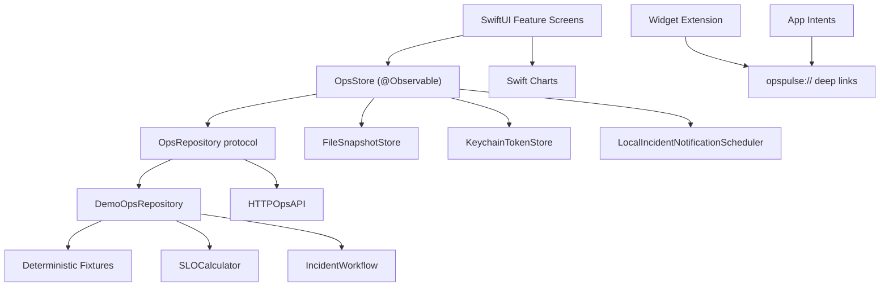

# OpsPulse

OpsPulse is a native SwiftUI iOS and iPadOS demo app for practicing Site Reliability Engineering incident command from a mobile device. It shows service health, SLO/error-budget math, active incidents, runbooks, simulations, and post-incident review export without requiring external accounts.

## Problem

SRE interviews often ask for practical judgment around incidents, SLOs, burn rate, runbooks, and safe operational workflows. OpsPulse turns those concepts into a working mobile app with deterministic data and tested domain logic, so the project can be demoed from a simulator and discussed from real source code.

## SRE Concepts Demonstrated

- Service catalog ownership, environments, status, saturation, latency, deployments, and open incidents
- Availability SLO targets and permitted failure percentages
- Error-budget consumed and remaining calculations
- Burn-rate classification: normal, elevated, high, critical
- Incident lifecycle enforcement from triggered through resolved
- MTTA, mitigation time, and MTTR calculations
- Runbook checklists with safe reference commands
- Demo-only reliability simulations and deterministic reset
- Markdown post-incident review export
- Live API adapter with typed connectivity, auth, decoding, timeout, and server errors

## Features

- Reliability overview with production/staging status, health counts, active P1/P2/P3 incidents, availability, budget remaining, burn rate, MTTA, MTTR, and last deployment
- Searchable service catalog with six deterministic sample services
- Service detail screens with Swift Charts for availability, error rate, P95 latency, and error budget
- Incident commander workflow with assignment, acknowledgement, valid transitions, timeline notes, runbook completion, resolution, and report sharing
- Reliability Lab with demo-only latency, database, auth, deployment, and regional outage simulations
- Offline deterministic fixtures and local snapshot persistence
- Live mode settings for base URL, Keychain token storage, and connection testing
- App Intents source for critical incidents and high-burn-rate services
- Widget extension source with incident deep link

## Screenshots

Real iPhone Simulator screenshots are available in [docs/screenshots/linkedin](docs/screenshots/linkedin):

- [Overview](docs/screenshots/linkedin/01-overview.png)
- [Services](docs/screenshots/linkedin/02-services.png)
- [Service detail](docs/screenshots/linkedin/03-service-detail.png)
- [Incidents](docs/screenshots/linkedin/04-incidents.png)
- [Incident detail](docs/screenshots/linkedin/05-incident-detail.png)
- [Reliability Lab](docs/screenshots/linkedin/06-reliability-lab.png)

Regenerate the LinkedIn/GitHub screenshot pack after selecting full Xcode:

```bash
scripts/capture_linkedin_screenshots.sh
```

The script builds the app, installs it on an iPhone simulator, launches each key screen, and captures PNG files with a clean simulator status bar.

## Architecture



Domain models and calculations live in `Sources/OpsPulseCore`. SwiftUI screens live under `OpsPulse/Features`. Platform adapters live under `OpsPulse/Platform`.

## Repository Structure

```text
OpsPulse.xcodeproj/            Generated Xcode project and shared scheme
OpsPulse/                      SwiftUI app source
OpsPulseWidget/                Widget extension source
Sources/OpsPulseCore/          Domain logic, fixtures, networking, persistence
Tests/OpsPulseCoreTests/       Swift Testing unit tests
docs/                          Architecture, API, security, testing, portfolio docs
docs/github-actions/ios.yml    CI workflow template
scripts/                       Build, test, launch, screenshot scripts
tools/generate_xcode_project.py
```

## Local Setup

1. Install full Xcode.
2. Select Xcode:

```bash
sudo xcode-select -s /Applications/Xcode.app/Contents/Developer
```

3. Generate the project:

```bash
python3 tools/generate_xcode_project.py
```

4. Open `OpsPulse.xcodeproj` or use the CLI scripts.

## Build And Test

Core tests run with the installed Swift toolchain:

```bash
swift test
```

Build the iOS app after full Xcode is selected:

```bash
scripts/build.sh
```

Build and launch:

```bash
scripts/build_and_launch.sh
```

Developers with Mac and Xcode can clone this repository and run those scripts to test the app in the iPhone Simulator. Direct iPhone installation for non-developers requires TestFlight or App Store distribution.

## Demo Instructions

1. Launch the app in demo mode.
2. Open `Reliability Lab`.
3. Run `API latency spike`.
4. The app navigates to the generated incident.
5. Assign a commander and acknowledge the incident.
6. Move through Investigating, Mitigating, Monitoring, and Resolved.
7. Complete at least one runbook step.
8. Share the Markdown post-incident review from the incident detail screen.
9. Use the reset action in Reliability Lab to restore deterministic fixtures.

## Live API Contract

The live adapter is disconnected by default. It is documented in [docs/API.md](docs/API.md) and supports:

- `GET /health`
- `GET /api/v1/services`
- `GET /api/v1/services/{id}`
- `GET /api/v1/incidents`
- `GET /api/v1/incidents/{id}`
- `POST /api/v1/incidents/{id}/acknowledge`
- `POST /api/v1/incidents/{id}/timeline`
- `POST /api/v1/incidents/{id}/transition`

## Security Decisions

- Demo mode requires no credentials.
- Live tokens are stored only in Keychain.
- Tokens are not logged or committed.
- Runbook commands are displayed as safe reference material only; the app never executes infrastructure commands.
- `.gitignore` excludes credentials, provisioning profiles, local env files, build output, and Xcode user state.

## Accessibility

- Text uses Dynamic Type-friendly SwiftUI styles.
- Statuses use icons and labels instead of color alone.
- Buttons, simulations, incidents, and runbook steps include accessibility labels or identifiers.
- Layout uses lists, adaptive grids, and standard controls for iPhone and iPad.

## Technical Trade-Offs

- Core logic is a Swift package so it can be tested without a simulator.
- The Xcode project is generated from source files to reduce project-file drift.
- CI workflow is stored under `docs/github-actions/ios.yml` because the current GitHub token lacks `workflow` scope.
- SwiftData was not required for the MVP; local persistence uses a native file-backed Codable snapshot.
- Widget and App Intents source is included, but full validation requires full Xcode.

## Known Limitations

- No real backend is bundled. Live mode is protocol-based and testable with a mock URL protocol.
- The widget displays static demo counts in this first pass rather than reading shared app-group state.
- Local notifications are demo-only and only scheduled for generated P1 incidents.

## Future Roadmap

- Add an app-group-backed widget timeline sourced from the latest snapshot.
- Add Xcode UI tests for the six smoke flows listed in [docs/TESTING.md](docs/TESTING.md).
- Add SwiftData models if incident notes need richer offline editing history.
- Add sample mock server fixtures for live-mode demos.
- Add a small simulator screenshot automation layer after full Xcode is available.
